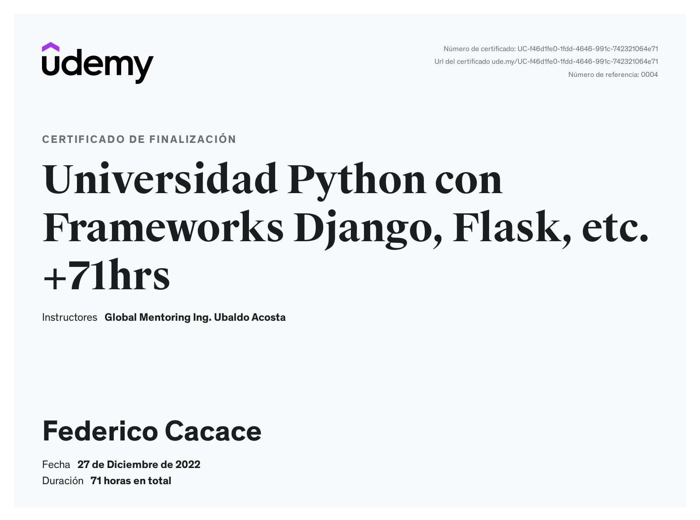
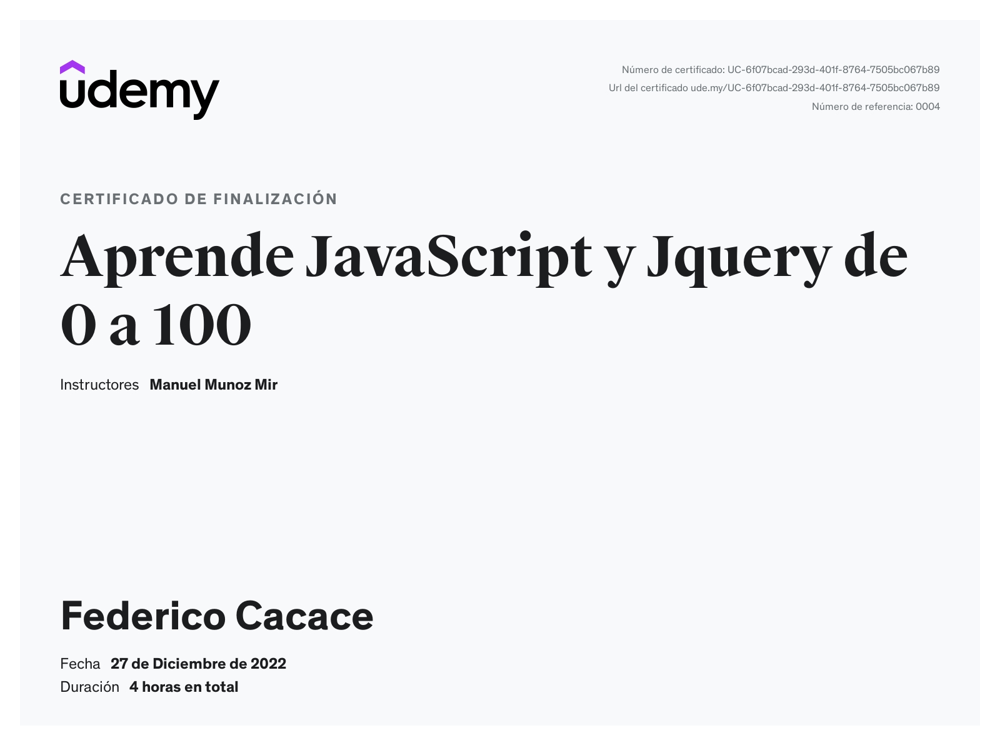

# 💫 About Me:
🔭 I’m currently working on Python scripts 🌱 I’m currently learning Scikit-Learn 💬 Ask me about Python and everything related to python scripts ⚡ Fun fact: i started programming with c++ but now i hate it.

## 🌐 Socials:
   

# 💻 Tech Stack:
                                              
# 📊 GitHub Stats:
 
 

  ## 💰 You can help me by Donating
    

## My Certifications

  

